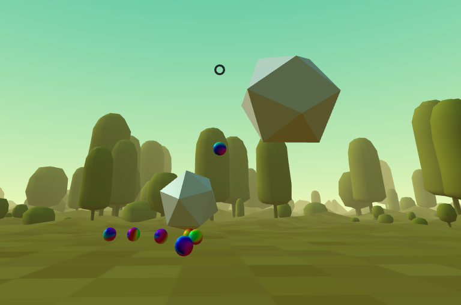
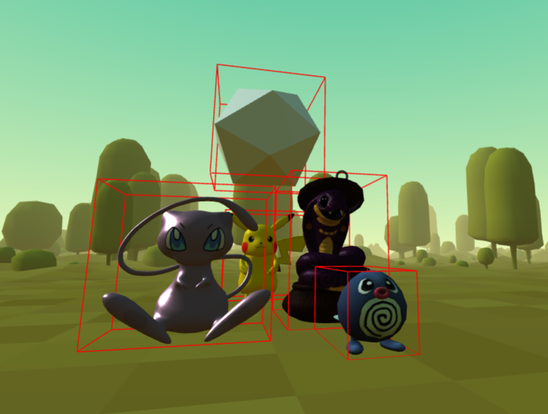

<h1>Computer Graphics and Computer Vision</h1>
<h2>Description:</h2>

This repository is used for storing sourcecode related to final project of Computer Graphics and Computer Vision

<h2>Table of content:</h2>
    <ol>
        <li><a href="#heading1">Docker image for Environment</a></li>
        <li>
            <a href="#heading2">Sourcecode for the project</a>
            <ol>
                <li>Baseline sourcecode</li>
                <li><a href="#imple-src">Implemented sourcecode</a>
                    <ul>
                        <li><a href="#abt-this">About this game</a></li>
                        <li><a href="#demo-game">Demo</a>
                            <ul>
                                <li><a href="https://vinhqngo5.github.io/Computer-Vision-And-Computer-Graphics/WebSrc/index.html">3D prototype game</a></li>
                                <li><a href="https://vinhqngo5.github.io/Computer-Vision-And-Computer-Graphics/WebSrc/index-physics.html">3D prototype game with physics</a></li>
                                <li><a href="https://vinhqngo5.github.io/Computer-Vision-And-Computer-Graphics/WebSrc/AR.html">Pokemon Go game</a></li>
                                <li><a href="https://vinhqngo5.github.io/Computer-Vision-And-Computer-Graphics/WebSrc/AR-physics.html">Pokemon Go game with physics</a></li>
                            </ul>
                        </li>
                        <li><a href="#how-to-play">How to play</a></li>
                    </ul>
                </li>
            </ol>
        </li>
    </ol>

<h2 id="heading1">Docker image for Environment</h2>
<h3>1. Pull docker image</h3>
    <ul>
        <li>Install docker on Linux or WSL</li>
        <li>Open terminal and run command: <code>docker pull vinhqngo5/ubuntu-opencv-opengl:init-env</code></li>
    </ul>

<h3>2. Start a container</h3>
    <ul>
        <li>First of all, we need to change directory to the current Sourcecode (in this example is this repository)</li>
        <li>Second, we need to allow container for accessing the graphics card: 
            <code>sudo xhost +</code>
        </li>
        <li>Open terminal and run command: <code>docker run -it -v "$PWD":/root/CV-CG -v /tmp/.X11-unix:/tmp/.X11-unix -e DISPLAY=$DISPLAY --device="/dev/video0:/dev/video0" &#60image-name&#62;</code></li>
        <li>Now, your repository will mount into /root/CV-CG</li>
    </ul>

<h3>3. Connect VScode to running docker container (Just for directly modifying the container)</h3>
    <ul>
        <li>Install extension: Remote container - ms-vscode-remote.remote-containers</li>
        <li>Then we need to give user permission to docker group by: <code>sudo sudo usermod -aG docker ${USER}</code>. log out and log back in so that your group membership is re-evaluated or type the following command: <code>su -s ${USER}</code></li>
        <li>Press ctrl + shift + P: remote -> attach to running container</li>
        <li>Mount working directory in the left panel</li>
    </ul>

<h3>4. Start coding (Just use the docker container environment)</h3>
    <ul>
        <li>Open vscode in the repository folder and code, every changes will be saved</li>
        <li>To compile C++ code, use this command: <code>g++ main.cpp -o main -I /usr/local/include/opencv4 -L /usr/local/lib -lopencv_core -lopencv_highgui</code></li>
        <li>There maybe some changes in running command, if use "opencv2/core" -> add -lopencv_core </li>
        <li>Then chmod and run code like normal</li>
        <li>Shoud do: create make file for convenience</li>
    </ul>

<h2 id="heading2">Sourcecode for the project</h2>
<h3>1. Baseline sourcecode</h3>
<h3 id="imple-src">2. Implemented sourcecode</h3>
<h4 id="abt-this">⦾ About this game</h4>
This is a simple game which targets to provide a similar Pokemon Go like shooting experiences, where a "shooter" shoots "bullets" that can hit "targets" (Pokemon balls hit Pokemons).  A large chunk of the game can be handled at just the declarative A-Frame layer in HTML, which is compatible with multi-platform and easy to deploy.
<h4 id="demo-game">⦾ Demo</h4>
<ul>
    <li><a href="https://vinhqngo5.github.io/Computer-Vision-And-Computer-Graphics/WebSrc/index.html">3D prototype game</a></li>
    <li><a href="https://vinhqngo5.github.io/Computer-Vision-And-Computer-Graphics/WebSrc/index-physics.html">3D prototype game with physics</a></li>
    <li><a href="https://vinhqngo5.github.io/Computer-Vision-And-Computer-Graphics/WebSrc/AR.html">Pokemon Go game</a></li>
    <li><a href="https://vinhqngo5.github.io/Computer-Vision-And-Computer-Graphics/WebSrc/AR-physics.html">Pokemon Go game with physics</a></li>
</ul>
<h4 id="how-to-play">⦾ How to play</h4>

<ul>
    <li>Use keyboard keys <kbd>A</kbd> <kbd>W</kbd> <kbd>S</kbd> <kbd>D</kbd> and <kbd>mouse</kbd> for moving around and chaging view in PC.</li>
    <li>Use gestures <kbd>=></kbd>(swipe right) and <kbd><=</kbd>(swipe left) for changing view in Mobile.</li>
    <li>Pressing <kbd>space</kbd> for shooting in PC. Velocity of the bullets are based on how long you press the button.</li>
    <li>Use gesture <kbd>swipe up</kbd> for shooting in Mobile. Velocity of the bullets are based on how fast you swipe.</li>
</ul>

